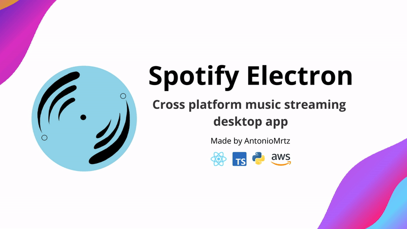
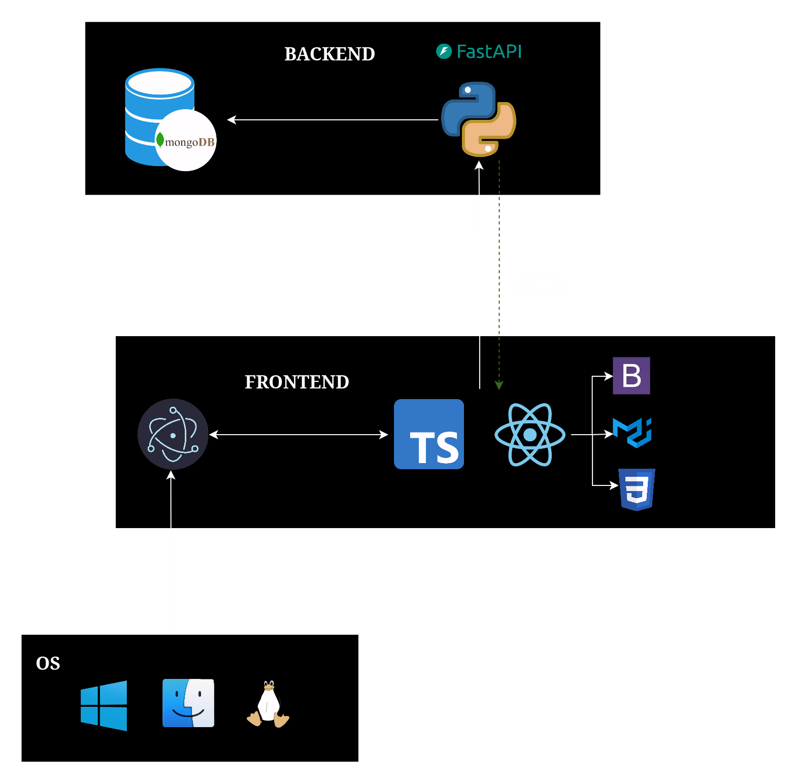
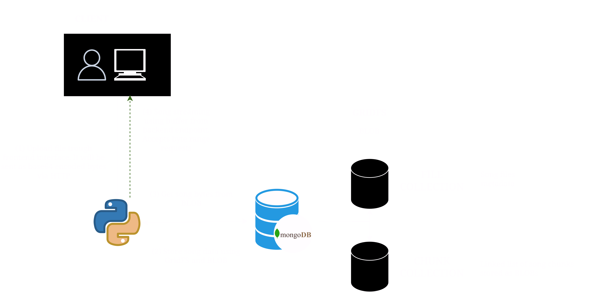

<div align="center">


# 🎵 Spotify Electron

### Plataforma de streaming musical multiplataforma con Electron 🚀

<p align="center">
  Spotify Electron es una aplicación de streaming musical de escritorio desarrollada con <b>Electron</b>, <b>React</b>, <b>FastAPI</b> y <b>MongoDB</b>, diseñada para replicar una experiencia similar a Spotify con funciones modernas y soporte para música personal.
</p>

<p align="center">
  
  
  
  
  
</p>

<p align="center">
  <a href="#-preview">Preview</a> •
  <a href="#-características">Características</a> •
  <a href="#-arquitectura">Arquitectura</a> •
  <a href="#-tecnologías-utilizadas">Tecnologías</a> •
  <a href="#-instalación">Instalación</a>
</p>

</div>

---

# 🌊 Acerca de Spotify Electron

**Spotify Electron** es una plataforma de streaming musical open source enfocada en escritorio, creada para ofrecer una experiencia moderna, rápida y altamente personalizable.

La aplicación combina:

- ⚛️ Frontend moderno con React + Electron
- ⚡ Backend rápido con FastAPI
- ☁️ Base de datos MongoDB
- 🎵 Streaming multimedia
- 📂 Subida de música personal
- 🔄 Arquitectura full stack escalable

El objetivo del proyecto es replicar las funciones esenciales de Spotify mientras añade herramientas más abiertas y personalizables para los usuarios.

---

# 📸 Preview

<div align="center">



</div>

---

# ✨ Características

# 🎧 Streaming Musical

- ▶️ Reproducción multimedia
- ⏯️ Controles avanzados
- 🔊 Audio streaming en tiempo real
- 📂 Biblioteca musical
- 🎶 Gestión de playlists

---

# 📤 Música Personal

- ☁️ Subida de canciones propias
- 📁 Gestión multimedia
- 🎼 Organización de archivos
- 🎵 Biblioteca personalizada
- 💾 Almacenamiento persistente

---

# 🖥️ Aplicación Desktop

- 🪟 Windows
- 🍎 macOS
- 🐧 Linux
- ⚡ Electron Cross Platform
- 🎨 UI moderna inspirada en Spotify

---

# 🔥 Experiencia Moderna

- 🎨 Diseño responsive
- ⚛️ React Components
- ⚡ Navegación rápida
- 🎵 Reproducción continua
- 🌙 Interfaz elegante

---

# 🏗️ Arquitectura Full Stack

- ⚛️ Frontend Electron + React
- ⚡ API REST con FastAPI
- ☁️ MongoDB Database
- 🔐 Backend escalable
- 📦 Arquitectura modular

---

# 📸 Arquitectura del Sistema

<div align="center">



</div>

---

# 🎵 Arquitectura Multimedia

<div align="center">



</div>

---

# 🎥 Demo

<div align="center">

https://github.com/user-attachments/assets/1f32fa25-e99f-4cc3-8664-b21bce155934

</div>

---

# 🛠️ Tecnologías Utilizadas

## 💻 Frontend

<p>
  
</p>

- Electron
- React.js
- Redux
- HTML5
- CSS3
- JavaScript

---

## ⚙️ Backend

<p>
  
</p>

- Python
- FastAPI
- MongoDB
- REST API

---

## 🎵 Multimedia

- Audio Streaming
- Media Playback
- Upload Music System
- Playlist Management

---

## ☁️ Base de Datos

- MongoDB Collections
- User Data
- Music Metadata
- Playlists
- Library Management

---

## 🧰 Herramientas

<p>
  
</p>

- Git & GitHub
- VS Code
- Docker
- Node.js

---

# 📂 Estructura del Proyecto

```bash
SpotifyElectron/
│
├── frontend/               # Aplicación Electron + React
├── backend/                # API FastAPI
├── docs/                   # Documentación
├── assets/                 # Recursos multimedia
├── database/               # Configuración MongoDB
└── README.md
```

---

# ⚡ Instalación

## 1️⃣ Clonar el repositorio

```bash
git clone https://github.com/AntonioMrtz/SpotifyElectron.git
cd SpotifyElectron
```

---

# 🔥 Requisitos

- Node.js 18+
- Python 3.10+
- MongoDB
- npm o yarn
- Git

---

# ▶️ Configurar Frontend

```bash
cd frontend
npm install
npm run dev
```

---

# ⚙️ Configurar Backend

```bash
cd backend
pip install -r requirements.txt
uvicorn main:app --reload
```

---

# 🖥️ Ejecutar Aplicación

```bash
npm run electron
```

---

# 🌐 Sitio Web

## Página Oficial

```bash
https://antoniomrtz.github.io/SpotifyElectron_Web/
```

---

# 📚 Documentación

## Docs del Proyecto

```bash
docs/
```

Incluye:

- ⚙️ Configuración
- 🏗️ Arquitectura
- 🖥️ Frontend
- ⚡ Backend
- 🤝 Contribuciones

---

# 🚀 Funcionalidades Completadas

## ✅ Implementado

- 🎵 Streaming multimedia
- 📂 Upload de música
- 🎶 Biblioteca musical
- ⚛️ Frontend React
- ⚡ Backend FastAPI
- ☁️ MongoDB integration
- 🖥️ Electron desktop app
- 🔐 Arquitectura full stack

---

# 📊 Roadmap

## 🚧 Próximamente

- ❤️ Favoritos inteligentes
- 🤖 Recomendaciones IA
- ☁️ Sincronización en la nube
- 📱 Aplicación móvil
- 🎧 Letras sincronizadas
- 👥 Sistema social
- 📡 Streaming avanzado
- 🎼 Equalizer

---

# 🤝 Contribuciones

Las contribuciones son bienvenidas ❤️

## Pasos para contribuir

1. Haz Fork del proyecto
2. Crea una rama

```bash
git checkout -b feature/nueva-funcion
```

3. Realiza tus cambios
4. Haz commit

```bash
git commit -m "✨ Nueva funcionalidad"
```

5. Haz push

```bash
git push origin feature/nueva-funcion
```

6. Abre un Pull Request 🚀

---

# 👨‍💻 Contributors

Gracias a todos los desarrolladores que hacen posible este proyecto 🎵

<div align="center">

⭐ Comunidad Open Source  
🚀 Desarrollo colaborativo  
🎧 Innovación multimedia

</div>

---

# 👨‍💻 Autor

<div align="center">


## Isai Reyes

Desarrollador Full Stack apasionado por aplicaciones multimedia, streaming y arquitecturas modernas.

</div>

---

# 🌟 Apoya el Proyecto

Si te gusta Spotify Electron:

⭐ Dale una estrella al repositorio  
🍴 Haz Fork del proyecto  
📢 Compártelo con otros desarrolladores

---

# 📜 Licencia

Este proyecto está bajo la licencia **MIT**.

---

# ⚠️ Disclaimer

> Spotify Electron es un proyecto open source desarrollado con fines educativos y multimedia.
> El contenido reproducido pertenece a sus respectivos propietarios.

---

<div align="center">

### 🎶 Spotify Electron — Streaming de música moderno para escritorio.

</div>
